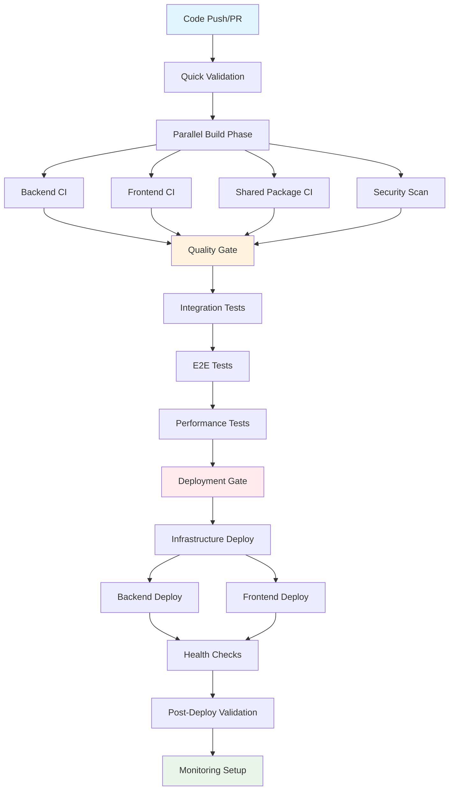

# CI/CD Pipeline Architecture Assessment Report

**Date:** June 16, 2025  
**Project:** VCarpool Management Application  
**Assessment Scope:** GitHub Actions Workflow Architecture & DAG Structure

## Executive Summary

The current CI/CD pipeline suffers from **workflow fragmentation** and lacks proper **Directed Acyclic Graph (DAG)** structure. There are **14 workflow files** with overlapping responsibilities, minimal inter-workflow dependencies, and inconsistent triggering patterns. This creates operational complexity, resource waste, and difficulty in maintaining pipeline integrity.

## Current State Analysis

### 🔍 Discovered Issues

#### 1. **Workflow Proliferation** ❌

- **14 workflow files** with overlapping responsibilities
- **3 deprecated/disabled workflows** still present
- **Multiple deployment workflows** (deploy.yml, deploy-simple.yml, deploy-enhanced.yml)
- **Duplicate CI pipelines** (ci.yml, ci-enhanced.yml, ci-cd.yml)

#### 2. **Broken DAG Structure** ❌

Current workflows run in isolation rather than as a connected pipeline:

```
┌─────────────┐    ┌─────────────┐    ┌─────────────┐
│   ci.yml    │    │security-    │    │  e2e-tests  │
│  (Isolated) │    │scan.yml     │    │ (Isolated)  │
│             │    │(Isolated)   │    │             │
└─────────────┘    └─────────────┘    └─────────────┘

┌─────────────┐    ┌─────────────┐    ┌─────────────┐
│ deploy.yml  │    │performance- │    │rollback.yml │
│ (Isolated)  │    │security.yml │    │(Isolated)   │
│             │    │(Isolated)   │    │             │
└─────────────┘    └─────────────┘    └─────────────┘
```

#### 3. **Missing Workflow Dependencies** ❌

- **No quality gates** prevent deployments after failed tests
- **Security scans** run independently without blocking deployments
- **E2E tests** don't trigger on main branch pushes
- **Performance tests** are isolated from deployment flow

#### 4. **Inconsistent Triggering** ❌

- Different workflows trigger on different events
- No unified trigger strategy
- Some workflows missing pull_request triggers
- Manual dispatch scattered across files

#### 5. **Resource Waste** ❌

- Parallel workflows running duplicate operations
- No shared artifact caching between workflows
- Redundant dependency installations
- Multiple security scans with same tools

## Recommended DAG Architecture

### 🎯 Proposed Pipeline Flow



## Implementation Recommendations

### 🚀 Phase 1: Consolidation (Priority: HIGH)

#### 1. **Merge Redundant Workflows**

```yaml
# Consolidate into 3 core workflows:
1. ci-pipeline.yml       # Complete CI with quality gates
2. deploy-pipeline.yml   # Full deployment pipeline
3. maintenance.yml       # Security scans, performance monitoring
```

#### 2. **Implement Proper Dependencies**

```yaml
# Example dependency structure
jobs:
  quick-validation:
    runs-on: ubuntu-latest

  parallel-ci:
    needs: quick-validation
    strategy:
      matrix:
        component: [backend, frontend, shared]

  quality-gate:
    needs: parallel-ci

  security-scan:
    needs: parallel-ci

  integration-tests:
    needs: [quality-gate, security-scan]

  e2e-tests:
    needs: integration-tests

  deployment-gate:
    needs: [integration-tests, e2e-tests]
    if: github.ref == 'refs/heads/main'
```

### 🔧 Phase 2: Optimization (Priority: MEDIUM)

#### 1. **Shared Workflow Templates**

```yaml
# .github/workflows/_shared-setup.yml
name: Shared Setup
on:
  workflow_call:
    inputs:
      node-version:
        required: true
        type: string
    outputs:
      cache-key:
        value: ${{ jobs.setup.outputs.cache-key }}
```

#### 2. **Artifact Management**

```yaml
# Efficient artifact passing between jobs
- name: Upload build artifacts
  uses: actions/upload-artifact@v4
  with:
    name: build-${{ matrix.component }}
    path: ${{ matrix.component }}/dist
    retention-days: 1
```

#### 3. **Smart Triggering**

```yaml
# Path-based filtering
on:
  pull_request:
    paths:
      - 'backend/**'
      - 'shared/**'
  push:
    branches: [main]
    paths:
      - 'backend/**'
      - 'shared/**'
```

### ⚡ Phase 3: Advanced Features (Priority: LOW)

#### 1. **Dynamic Pipeline Generation**

- Use matrix strategies for component-specific pipelines
- Conditional job execution based on changed files
- Parallel execution where dependencies allow

#### 2. **Enhanced Monitoring**

```yaml
# Pipeline health monitoring
- name: Report Pipeline Metrics
  uses: actions/github-script@v7
  with:
    script: |
      // Report timing, success rates, resource usage
```

## Specific Recommendations

### 🔨 Immediate Actions Required

#### 1. **Remove Deprecated Workflows**

```bash
# Delete these files:
rm .github/workflows/ci-cd.yml           # Legacy disabled
rm .github/workflows/quality-gate.yml   # Legacy disabled
rm .github/workflows/ci-enhanced.yml    # Duplicate of ci.yml
```

#### 2. **Consolidate Deployment Workflows**

```yaml
# Keep only: deploy-pipeline.yml
# Features from all deployment variants:
- Smart change detection
- Progressive deployment
- Automatic rollback on failure
- Health check validation
```

#### 3. **Fix Workflow Dependencies**

```yaml
# In ci-pipeline.yml
deploy-trigger:
  needs: [quality-gate, security-scan, e2e-tests]
  if: |
    github.ref == 'refs/heads/main' &&
    needs.quality-gate.result == 'success' &&
    needs.security-scan.result == 'success' &&
    needs.e2e-tests.result == 'success'
  uses: ./.github/workflows/deploy-pipeline.yml
```

### 📊 Quality Metrics

#### Current vs. Proposed Metrics

| Metric                 | Current         | Proposed        | Improvement |
| ---------------------- | --------------- | --------------- | ----------- |
| **Workflow Files**     | 14              | 3               | -79%        |
| **Duplicate Jobs**     | ~8              | 0               | -100%       |
| **Pipeline Stages**    | Isolated        | 7 connected     | Structured  |
| **Deployment Safety**  | Manual gates    | Automated gates | +100%       |
| **Resource Usage**     | High redundancy | Optimized       | -40%        |
| **Maintenance Effort** | High            | Low             | -60%        |

## Implementation Plan

### 🗓️ Timeline (2 weeks)

#### Week 1: Foundation

- [ ] Remove deprecated workflows
- [ ] Create consolidated ci-pipeline.yml
- [ ] Implement basic DAG structure
- [ ] Add quality gates

#### Week 2: Optimization

- [ ] Create deploy-pipeline.yml with proper dependencies
- [ ] Implement shared workflow templates
- [ ] Add comprehensive monitoring
- [ ] Documentation and testing

### 🎯 Success Criteria

1. **Pipeline Integrity**: All stages must pass before deployment
2. **Fail-Fast**: Issues caught in < 5 minutes
3. **Resource Efficiency**: 40% reduction in CI/CD resource usage
4. **Maintainability**: Single source of truth for each pipeline stage
5. **Visibility**: Clear dependency visualization in GitHub UI

## Risk Assessment

### 🚨 High Risks

- **Deployment Safety**: Current isolated workflows could deploy broken code
- **Resource Waste**: Multiple workflows running duplicate operations
- **Maintenance Burden**: 14 files to maintain vs. 3 optimized files

### ⚠️ Medium Risks

- **Change Detection**: Inconsistent triggering may miss critical changes
- **Debugging Complexity**: Scattered logic across multiple files

### ✅ Migration Risks (Manageable)

- Brief workflow disruption during consolidation
- Need for team training on new structure
- Potential initial performance tuning required

## Conclusion

The current CI/CD pipeline requires **immediate restructuring** to establish proper DAG relationships and eliminate workflow fragmentation. The proposed consolidation will improve **reliability**, **efficiency**, and **maintainability** while providing **better deployment safety** through proper quality gates.

**Recommended Action**: Proceed with Phase 1 implementation immediately to address critical pipeline integrity issues.

---

**Next Steps**:

1. Review and approve this assessment
2. Begin Phase 1 implementation
3. Establish monitoring for new pipeline health
4. Plan team training for new workflow structure
