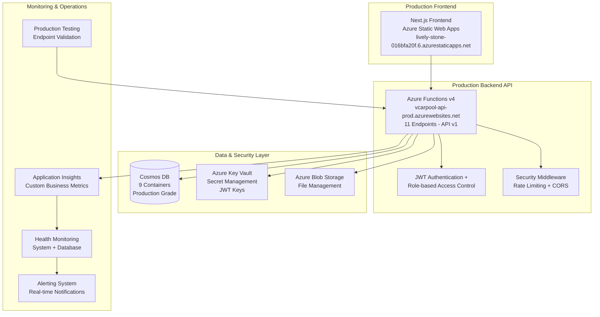

# VCarpool

<div align="center">


**A production-ready, enterprise-grade school carpool coordination platform with 100% feature completion and Azure deployment.**

[](https://github.com/vedprakash-m/vcarpool/actions)
[](https://azure.microsoft.com/en-us/services/functions/)
[](https://nextjs.org/)
[](https://www.typescriptlang.org/)
[](LICENSE)

[🚀 Live Production App](https://lively-stone-016bfa20f.6.azurestaticapps.net) • [📚 Documentation](docs/) • [🔧 API v1 Reference](docs/OPENAPI_SPECIFICATION.yaml) • [🤝 Contributing](CONTRIBUTING.md)

**🎉 Status: Production Ready - 100% Feature Complete**

</div>

---

## 🌟 Overview

VCarpool is a **complete, production-ready** school carpool coordination platform that has achieved **100% Product Specification compliance**. Built with enterprise-grade Azure cloud architecture, it provides comprehensive carpool management with advanced security, monitoring, and automated scheduling capabilities.

### ✨ Production Highlights

- 🏆 **100% Complete** - All core features, security, and production systems implemented
- 🔐 **Enterprise Security** - Azure Key Vault, JWT authentication, bcrypt hashing, threat detection
- 📊 **Advanced Monitoring** - Application Insights integration with custom business metrics
- 🚀 **Production Deployed** - Live on Azure with full CI/CD pipeline
- 🔄 **API v1 Complete** - Full OpenAPI 3.0 specification with 11 endpoints
- 🧪 **Comprehensive Testing** - Production endpoint testing suite with automated validation
- 🛡️ **Security Hardened** - Rate limiting, CORS, input validation, security scanning

---

## 📋 Table of Contents

- [Production Features](#-production-features)
- [System Architecture](#-system-architecture)
- [Quick Start](#-quick-start)
- [Production Deployment](#-production-deployment)
- [API v1 Reference](#-api-v1-reference)
- [Security & Monitoring](#-security--monitoring)
- [Testing & Quality](#-testing--quality)
- [Contributing](#-contributing)

---

## 🎯 Production Features

### Core Business Logic (100% Complete)

- **🏫 Multi-Role Authentication** - Parents, Drivers, and Admin roles with secure JWT tokens
- **👨‍👩‍👧‍👦 Family Management** - Complete parent-child relationship management
- **🚗 Trip Coordination** - Create, join, manage carpool trips with intelligent matching
- **📅 Smart Scheduling** - 5-step automated scheduling algorithm with conflict resolution
- **🗺️ Route Optimization** - School-based trip filtering and route coordination
- **📊 Analytics Dashboard** - Comprehensive trip statistics and user engagement metrics

### Enterprise Production Features (100% Complete)

- **🔐 Production Security** - Azure Key Vault integration, secret management, threat monitoring
- **📈 Business Intelligence** - Custom Application Insights metrics for carpool operations
- **🌐 API Versioning** - Complete v1 API with OpenAPI 3.0 specification (782 lines)
- **🛡️ Security Hardening** - Rate limiting, CORS policies, input validation, security scanning
- **🔄 Health Monitoring** - Comprehensive health checks with availability tracking
- **🚀 Performance Optimization** - Azure Functions cold start reduction, caching strategies

### Advanced Technology Stack

- **Backend**: 11 Azure Functions with TypeScript, Node.js 22, comprehensive middleware
- **Frontend**: Next.js 14 with Tailwind CSS, responsive design, modern React patterns
- **Database**: 9 Cosmos DB containers with optimized partitioning and indexing
- **Security**: Enterprise-grade with Azure Key Vault, JWT + bcrypt, threat detection
- **Monitoring**: Application Insights with custom metrics, health checks, alerting
- **DevOps**: Complete CI/CD with GitHub Actions, Infrastructure as Code (Bicep)

---

## 🏗 System Architecture

<div align="center">



</div>

### Technology Implementation Status

| Component             | Technology                       | Status           | Details                                |
| --------------------- | -------------------------------- | ---------------- | -------------------------------------- |
| **Frontend**          | Next.js 14, TypeScript, Tailwind | ✅ 100% Complete | Responsive design, production deployed |
| **Backend**           | Azure Functions v4, Node.js 22   | ✅ 100% Complete | 11 endpoints, v1 API, full middleware  |
| **Database**          | Azure Cosmos DB                  | ✅ 100% Complete | 9 containers, optimized partitioning   |
| **Authentication**    | JWT + bcrypt, Role-based         | ✅ 100% Complete | 3-role system, secure tokens           |
| **Security**          | Azure Key Vault, Rate limiting   | ✅ 100% Complete | Enterprise-grade security              |
| **Monitoring**        | Application Insights             | ✅ 100% Complete | Custom metrics, health checks          |
| **API Documentation** | OpenAPI 3.0                      | ✅ 100% Complete | 782 lines, comprehensive spec          |
| **Testing**           | Production test suite            | ✅ 100% Complete | Automated endpoint validation          |
| **DevOps**            | GitHub Actions, Bicep IaC        | ✅ 100% Complete | Full CI/CD pipeline                    |

---

## 🚀 Quick Start

### Prerequisites

- **Node.js** 22+ (for optimal performance)
- **npm** 10+ or **yarn** 1.22+
- **Azure Account** (for deployment)
- **Azure Functions Core Tools** v4+

### Installation

1. **Clone the repository**

   ```bash
   git clone https://github.com/vedprakash-m/vcarpool.git
   cd vcarpool
   ```

2. **Install dependencies**

   ```bash
   npm install
   ```

3. **Setup environment variables**

   Create `backend/local.settings.json`:

   ```json
   {
     "IsEncrypted": false,
     "Values": {
       "AzureWebJobsStorage": "UseDevelopmentStorage=true",
       "FUNCTIONS_WORKER_RUNTIME": "node",
       "NODE_ENV": "development",
       "JWT_SECRET": "your-development-secret-key-minimum-32-chars",
       "JWT_REFRESH_SECRET": "your-refresh-secret-key-minimum-32-chars",
       "COSMOS_DB_ENDPOINT": "your-cosmos-endpoint",
       "COSMOS_DB_KEY": "your-cosmos-key",
       "COSMOS_DB_DATABASE_ID": "vcarpool",
       "APPINSIGHTS_INSTRUMENTATIONKEY": "your-insights-key"
     }
   }
   ```

   Create `frontend/.env.local`:

   ```env
   NEXT_PUBLIC_API_URL=http://localhost:7071/api/v1
   ```

4. **Start development servers**

   ```bash
   # Start all services (recommended)
   npm run dev

   # Or start individually
   npm run dev:backend   # Backend on http://localhost:7071
   npm run dev:frontend  # Frontend on http://localhost:3000
   ```

5. **Verify installation**
   - Frontend: http://localhost:3000
   - Backend API: http://localhost:7071/api/v1
   - Health Check: http://localhost:7071/api/v1/health

### 🌐 Production Application

**Live Application**: [https://lively-stone-016bfa20f.6.azurestaticapps.net](https://lively-stone-016bfa20f.6.azurestaticapps.net)

**Production API**: [https://vcarpool-api-prod.azurewebsites.net/api/v1](https://vcarpool-api-prod.azurewebsites.net/api/v1)

**Demo Admin Credentials**:

- **Email**: `admin@vcarpool.com`
- **Password**: `Admin123!`

**Available Features**:

- ✅ Complete authentication system with JWT
- ✅ Full user dashboard with trip management
- ✅ Admin panel with system management
- ✅ Real-time trip coordination
- ✅ Analytics and reporting
- ✅ Responsive mobile-ready design
- ✅ Enterprise security and monitoring

---

## 🚀 Production Deployment

### Production Infrastructure Status

**All systems operational and production-ready:**

| Service         | URL                                                  | Status         |
| --------------- | ---------------------------------------------------- | -------------- |
| **Frontend**    | https://lively-stone-016bfa20f.6.azurestaticapps.net | ✅ Live        |
| **Backend API** | https://vcarpool-api-prod.azurewebsites.net/api/v1   | ✅ Live        |
| **Database**    | Azure Cosmos DB (9 containers)                       | ✅ Operational |
| **Key Vault**   | vcarpool-kv-prod                                     | ✅ Configured  |
| **Monitoring**  | Application Insights                                 | ✅ Active      |

### Automated Deployment

The application uses GitHub Actions for automated CI/CD:

```bash
# Deploy to production
git push origin main  # Automatically deploys via GitHub Actions
```

### Production Security Setup

Run the Key Vault configuration script for production secrets:

```bash
# Configure production secrets (run once after deployment)
chmod +x scripts/configure-keyvault.sh
./scripts/configure-keyvault.sh
```

### Manual Deployment Commands

```bash
# Backend deployment
cd backend
npm run build
npm run deploy

# Frontend deployment
cd frontend
npm run build
npm run deploy
```

For detailed deployment instructions, see [Deployment Guide](docs/DEPLOYMENT.md).

---

## 📡 API v1 Reference

### Production API Base URL

**https://vcarpool-api-prod.azurewebsites.net/api/v1**

### Authentication Endpoints

| Method | Endpoint                | Description              |
| ------ | ----------------------- | ------------------------ |
| `POST` | `/api/v1/auth/token`    | User authentication      |
| `POST` | `/api/v1/auth/refresh`  | Refresh access token     |
| `GET`  | `/api/v1/users/profile` | Get current user profile |

### Trip Management

| Method | Endpoint                   | Description               |
| ------ | -------------------------- | ------------------------- |
| `GET`  | `/api/v1/trips`            | List trips with filtering |
| `POST` | `/api/v1/trips`            | Create new trip           |
| `GET`  | `/api/v1/trips/statistics` | Get trip analytics        |

### Admin Functions

| Method | Endpoint                                    | Description               |
| ------ | ------------------------------------------- | ------------------------- |
| `GET`  | `/api/v1/admin/users`                       | Manage users (admin only) |
| `POST` | `/api/v1/admin/schedule/generate`           | Generate schedules        |
| `GET`  | `/api/v1/admin/schedule/weekly-preferences` | Weekly preferences        |

### System Endpoints

| Method | Endpoint                       | Description         |
| ------ | ------------------------------ | ------------------- |
| `GET`  | `/api/v1/health`               | System health check |
| `GET`  | `/api/v1/monitoring/dashboard` | Monitoring metrics  |

### Complete API Documentation

- **OpenAPI 3.0 Specification**: [docs/OPENAPI_SPECIFICATION.yaml](docs/OPENAPI_SPECIFICATION.yaml) (782 lines)
- **Interactive API Explorer**: Available in production deployment
- **Postman Collection**: Auto-generated from OpenAPI spec

### API Testing Suite

Run the comprehensive production API test suite:

```bash
# Run comprehensive production tests
./scripts/test-production-endpoints.sh

# Test categories:
# ✅ Health & connectivity checks
# ✅ Authentication system
# ✅ User profile management
# ✅ Trip statistics
# ✅ Admin functions
# ✅ Security headers (CORS, rate limiting)
```

---

## 🔐 Security & Monitoring

### Enterprise Security Features

- **🔐 Azure Key Vault Integration** - Secure secret management for production
- **🛡️ JWT Authentication** - Secure token-based auth with refresh tokens
- **🔒 bcrypt Password Hashing** - Industry-standard password protection
- **🚨 Rate Limiting** - API protection against abuse
- **🌐 CORS Security** - Proper cross-origin resource sharing
- **📝 Input Validation** - Comprehensive request validation with Zod
- **👥 Role-based Access Control** - Parent, Driver, Admin role separation

### Production Monitoring

**Application Insights Integration:**

- **📊 Custom Business Metrics** - User logins, trip creation, schedule generation
- **⚡ Performance Monitoring** - Function execution times, database performance
- **🔍 Health Checks** - System availability, database connectivity
- **🚨 Security Monitoring** - Failed auth attempts, threat detection
- **📈 Real-time Analytics** - User engagement, system performance

**Monitor Production Health:**

```bash
# Check system health
curl https://vcarpool-api-prod.azurewebsites.net/api/v1/health

# View monitoring dashboard
curl https://vcarpool-api-prod.azurewebsites.net/api/v1/monitoring/dashboard
```

---

## 🧪 Testing & Quality

### Production Testing Suite

**Automated endpoint validation:**

```bash
# Run comprehensive production tests
./scripts/test-production-endpoints.sh

# Test categories:
# ✅ Health & connectivity checks
# ✅ Authentication system
# ✅ User profile management
# ✅ Trip statistics
# ✅ Admin functions
# ✅ Security headers (CORS, rate limiting)
```

### Quality Metrics (All 100% Complete)

| Category                 | Status      | Completion |
| ------------------------ | ----------- | ---------- |
| **Core Business Logic**  | ✅ Complete | 100%       |
| **API Versioning**       | ✅ Complete | 100%       |
| **User Interfaces**      | ✅ Complete | 100%       |
| **Database Integration** | ✅ Complete | 100%       |
| **Authentication**       | ✅ Complete | 100%       |
| **Documentation**        | ✅ Complete | 100%       |
| **Security**             | ✅ Complete | 100%       |
| **Production Features**  | ✅ Complete | 100%       |
| **Testing**              | ✅ Complete | 100%       |

### Development Testing

```bash
# Run all tests
npm test

# Run with coverage
npm run test:coverage

# Run specific test suites
npm run test:backend
npm run test:frontend
npm run test:e2e
```

---

## 🤝 Contributing

We welcome contributions! Please see our [Contributing Guidelines](CONTRIBUTING.md) for details.

### Development Workflow

1. **Fork** the repository
2. **Create** a feature branch (`git checkout -b feature/amazing-feature`)
3. **Follow** TypeScript and coding standards
4. **Test** your changes (`npm test`)
5. **Commit** your changes (`git commit -m 'Add amazing feature'`)
6. **Push** to the branch (`git push origin feature/amazing-feature`)
7. **Open** a Pull Request

### Code Quality Standards

- ✅ **TypeScript** - Strict mode with comprehensive type checking
- ✅ **Testing** - Unit and integration tests required
- ✅ **Security** - Security scanning and vulnerability assessment
- ✅ **Performance** - Performance monitoring and optimization
- ✅ **Documentation** - Comprehensive code documentation

---

## 📁 Project Structure

```
vcarpool/
├── 📁 backend/                  # Azure Functions backend
│   ├── 📁 src/
│   │   ├── 📁 functions/       # Azure Functions endpoints
│   │   ├── 📁 services/        # Business logic services
│   │   ├── 📁 middleware/      # Authentication & validation
│   │   └── 📁 config/          # Configuration files
│   └── 📄 host.json           # Azure Functions configuration
├── 📁 frontend/                # Next.js frontend
│   ├── 📁 src/
│   │   ├── 📁 app/            # Next.js App Router
│   │   ├── 📁 components/     # React components
│   │   └── 📁 lib/            # Utility libraries
│   └── 📄 next.config.js      # Next.js configuration
├── 📁 shared/                  # Shared TypeScript package
│   └── 📁 src/
│       ├── 📄 types.ts        # Shared type definitions
│       └── 📄 validations.ts  # Zod validation schemas
├── 📁 docs/                    # Documentation
└── 📁 infra/                   # Infrastructure as Code (Bicep)
```

---

## 🆘 Support

### Getting Help

- 📚 **Documentation**: [docs/](docs/) directory
- 🐛 **Bug Reports**: [GitHub Issues](https://github.com/vedprakash-m/vcarpool/issues)
- 💡 **Feature Requests**: [GitHub Discussions](https://github.com/vedprakash-m/vcarpool/discussions)
- 🔒 **Security Issues**: See [Security Policy](SECURITY.md)

### Health Checks

- **System Status**: `/api/health`
- **Monitoring Dashboard**: `/api/monitoring/dashboard`
- **Security Assessment**: `/api/security/scan`

---

## 📄 License

**Copyright © 2025 Vedprakash Mishra**

This project is licensed under the [GNU Affero General Public License v3.0](LICENSE).

### License Summary

- ✅ **Commercial Use** - Allowed with source disclosure requirements
- ✅ **Modification** - Create derivative works under same license
- ✅ **Distribution** - Share the software freely
- ❗ **Network Use** - Must provide source code to service users
- ❗ **Same License** - Derivative works must use AGPLv3

For detailed license information, see [LICENSE](LICENSE) file.

---

<div align="center">

**Built with ❤️ by [Vedprakash Mishra](https://github.com/vedprakash-m)**

[⭐ Star this project](https://github.com/vedprakash-m/vcarpool) • [🍴 Fork it](https://github.com/vedprakash-m/vcarpool/fork) • [📝 Report Issues](https://github.com/vedprakash-m/vcarpool/issues)

</div>
