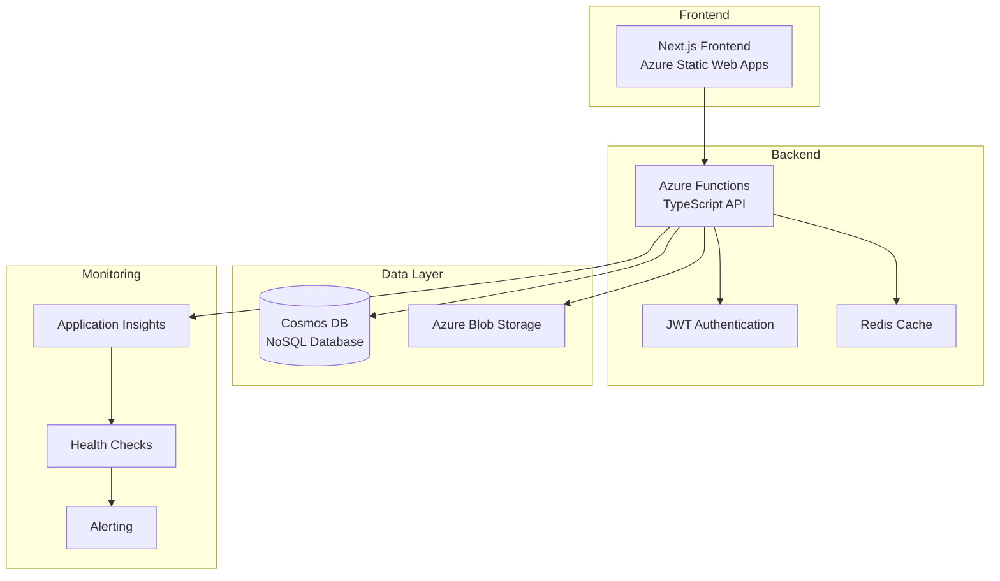

# VCarpool

<div align="center">


**A modern, enterprise-grade carpool management platform built for scalability, security, and performance.**

[](https://github.com/vedprakash-m/vcarpool/actions)
[](https://azure.microsoft.com/en-us/services/functions/)
[](https://nextjs.org/)
[](https://www.typescriptlang.org/)
[](LICENSE)

[Live Demo](https://vcarpool-web-prod.azurestaticapps.net) • [Documentation](docs/) • [API Reference](#-api-reference) • [Contributing](CONTRIBUTING.md)

</div>

---

## 🌟 Overview

VCarpool is a comprehensive carpool management application that connects drivers and passengers for efficient, eco-friendly transportation. Built with modern cloud-native architecture, it offers enterprise-grade security, real-time monitoring, and seamless user experience.

### ✨ Key Highlights

- 🔐 **Enterprise Security** - JWT authentication, role-based access control, and threat detection
- 🚀 **High Performance** - Optimized for Azure cloud with intelligent caching and cold start reduction
- 📊 **Real-time Monitoring** - Comprehensive observability with Application Insights integration
- 🌐 **Modern Stack** - TypeScript, Next.js, Azure Functions, and Cosmos DB
- 🔄 **CI/CD Ready** - Automated deployment with infrastructure as code

---

## 📋 Table of Contents

- [Features](#-features)
- [Architecture](#-architecture)
- [Quick Start](#-quick-start)
- [Deployment](#-deployment)
- [API Reference](#-api-reference)
- [Monitoring](#-monitoring)
- [Contributing](#-contributing)
- [License](#-license)

---

## 🎯 Features

### Core Functionality

- **User Management** - Secure registration, authentication, and profile management
- **Trip Management** - Create, search, join, and manage carpool trips with advanced filtering
- **Real-time Communication** - Instant notifications and trip updates
- **Smart Matching** - Intelligent trip recommendations based on preferences and routes
- **Analytics Dashboard** - Trip statistics, cost savings, and environmental impact tracking

### Enterprise Features

- **Advanced Security** - Multi-layer security with threat detection and vulnerability scanning
- **Performance Monitoring** - Real-time metrics, health checks, and performance optimization
- **Scalable Architecture** - Auto-scaling Azure Functions with intelligent resource management
- **Compliance Ready** - Data protection, audit logging, and regulatory compliance features

---

## 🏗 Architecture

<div align="center">



</div>

### Technology Stack

| Layer              | Technology                           | Purpose                                           |
| ------------------ | ------------------------------------ | ------------------------------------------------- |
| **Frontend**       | Next.js 14, TypeScript, Tailwind CSS | Modern React framework with server-side rendering |
| **Backend**        | Azure Functions v4, Node.js 22       | Serverless compute with TypeScript                |
| **Database**       | Azure Cosmos DB                      | NoSQL database with global distribution           |
| **Authentication** | JWT, bcrypt                          | Secure token-based authentication                 |
| **Monitoring**     | Application Insights, Custom Metrics | Real-time observability and alerting              |
| **Deployment**     | GitHub Actions, Azure DevOps         | CI/CD with infrastructure as code                 |

---

## 🚀 Quick Start

### Prerequisites

- **Node.js** 20+ (22+ recommended for backend)
- **npm** 10+ or **yarn** 1.22+
- **Azure Account** (for deployment)
- **Azure Functions Core Tools** v4+ (for local development)

### Installation

1. **Clone the repository**

   ```bash
   git clone https://github.com/vedprakash-m/vcarpool.git
   cd vcarpool
   ```

2. **Install dependencies**

   ```bash
   npm install
   ```

3. **Setup environment variables**

   Create `backend/local.settings.json`:

   ```json
   {
     "IsEncrypted": false,
     "Values": {
       "AzureWebJobsStorage": "UseDevelopmentStorage=true",
       "FUNCTIONS_WORKER_RUNTIME": "node",
       "NODE_ENV": "development",
       "JWT_SECRET": "your-development-secret-key",
       "JWT_REFRESH_SECRET": "your-refresh-secret-key",
       "COSMOS_DB_ENDPOINT": "your-cosmos-endpoint",
       "COSMOS_DB_KEY": "your-cosmos-key",
       "COSMOS_DB_DATABASE_ID": "vcarpool"
     }
   }
   ```

   Create `frontend/.env.local`:

   ```env
   NEXT_PUBLIC_API_URL=http://localhost:7071/api
   ```

4. **Start development servers**

   ```bash
   # Start all services
   npm run dev

   # Or start individually
   npm run dev:backend   # Backend on http://localhost:7071
   npm run dev:frontend  # Frontend on http://localhost:3000
   ```

5. **Access the application**
   - Frontend: http://localhost:3000
   - Backend API: http://localhost:7071/api
   - Health Check: http://localhost:7071/api/health

---

## 🚀 Deployment

### Automated Deployment (Recommended)

The application uses GitHub Actions for automated CI/CD deployment to Azure.

1. **Configure Azure Service Principal**

   ```bash
   az ad sp create-for-rbac --name "vcarpool-cicd" \
     --role contributor \
     --scopes /subscriptions/{subscription-id} \
     --sdk-auth
   ```

2. **Add GitHub Secrets**

   - `AZURE_CREDENTIALS`: Service Principal JSON from step 1

3. **Deploy**
   ```bash
   git push origin main  # Automatically deploys to production
   ```

### Manual Deployment

```bash
# Build and deploy backend
cd backend
npm run build
npm run deploy

# Build and deploy frontend
cd frontend
npm run build
az staticwebapp upload --name vcarpool-web-prod --source ./out
```

### Infrastructure

The deployment creates these Azure resources:

- **Function App** (`vcarpool-api-prod`) - Backend API
- **Static Web App** (`vcarpool-web-prod`) - Frontend hosting
- **Cosmos DB** (`vcarpool-cosmos-prod`) - Database
- **Application Insights** (`vcarpool-insights-prod`) - Monitoring
- **Key Vault** (`vcarpool-kv-prod`) - Secrets management

For detailed deployment instructions, see [CI/CD Setup Documentation](docs/CI-CD-SETUP.md).

---

## 📡 API Reference

### Authentication Endpoints

| Method | Endpoint             | Description              |
| ------ | -------------------- | ------------------------ |
| `POST` | `/api/auth/register` | User registration        |
| `POST` | `/api/auth/login`    | User authentication      |
| `POST` | `/api/auth/refresh`  | Refresh access token     |
| `GET`  | `/api/users/me`      | Get current user profile |

### Trip Management

| Method   | Endpoint               | Description               |
| -------- | ---------------------- | ------------------------- |
| `GET`    | `/api/trips`           | List trips with filtering |
| `POST`   | `/api/trips`           | Create new trip           |
| `PUT`    | `/api/trips/:id`       | Update trip               |
| `DELETE` | `/api/trips/:id`       | Cancel trip               |
| `POST`   | `/api/trips/:id/join`  | Join trip                 |
| `POST`   | `/api/trips/:id/leave` | Leave trip                |

### System Endpoints

| Method | Endpoint                    | Description         |
| ------ | --------------------------- | ------------------- |
| `GET`  | `/api/health`               | System health check |
| `GET`  | `/api/monitoring/dashboard` | Monitoring metrics  |
| `GET`  | `/api/security/scan`        | Security assessment |

For complete API documentation with request/response schemas, see our [API Documentation](docs/API.md).

---

## 📊 Monitoring

### Health Monitoring

The application includes comprehensive monitoring capabilities:

- **Real-time Health Checks** - Automated system health monitoring
- **Performance Metrics** - Response times, throughput, error rates
- **Business Analytics** - User engagement, trip statistics, cost savings
- **Security Monitoring** - Threat detection, failed authentication attempts

### Access Monitoring Dashboard

**Local Development:**

```bash
curl http://localhost:7071/api/health
curl http://localhost:7071/api/monitoring/dashboard
```

**Production:**

- Health Check: https://vcarpool-api-prod.azurewebsites.net/api/health
- Azure Application Insights: Available in Azure Portal

### Key Metrics

- **System Health**: Memory usage, response times, error rates
- **Performance**: API latency, cache hit rates, database performance
- **Business**: Active users, trips created, user engagement
- **Security**: Authentication attempts, threat detection alerts

---

## 🤝 Contributing

We welcome contributions! Please see our [Contributing Guidelines](CONTRIBUTING.md) for details.

### Development Workflow

1. **Fork** the repository
2. **Create** a feature branch (`git checkout -b feature/amazing-feature`)
3. **Follow** TypeScript and coding standards
4. **Test** your changes (`npm test`)
5. **Commit** your changes (`git commit -m 'Add amazing feature'`)
6. **Push** to the branch (`git push origin feature/amazing-feature`)
7. **Open** a Pull Request

### Code Quality Standards

- ✅ **TypeScript** - Strict mode with comprehensive type checking
- ✅ **Testing** - Unit and integration tests required
- ✅ **Security** - Security scanning and vulnerability assessment
- ✅ **Performance** - Performance monitoring and optimization
- ✅ **Documentation** - Comprehensive code documentation

---

## 📁 Project Structure

```
vcarpool/
├── 📁 backend/                  # Azure Functions backend
│   ├── 📁 src/
│   │   ├── 📁 functions/       # Azure Functions endpoints
│   │   ├── 📁 services/        # Business logic services
│   │   ├── 📁 middleware/      # Authentication & validation
│   │   └── 📁 config/          # Configuration files
│   └── 📄 host.json           # Azure Functions configuration
├── 📁 frontend/                # Next.js frontend
│   ├── 📁 src/
│   │   ├── 📁 app/            # Next.js App Router
│   │   ├── 📁 components/     # React components
│   │   └── 📁 lib/            # Utility libraries
│   └── 📄 next.config.js      # Next.js configuration
├── 📁 shared/                  # Shared TypeScript package
│   └── 📁 src/
│       ├── 📄 types.ts        # Shared type definitions
│       └── 📄 validations.ts  # Zod validation schemas
├── 📁 docs/                    # Documentation
└── 📁 infra/                   # Infrastructure as Code (Bicep)
```

---

## 🧪 Testing

```bash
# Run all tests
npm test

# Run backend tests
npm run test:backend

# Run frontend tests
npm run test:frontend

# Run end-to-end tests
npm run test:e2e

# Run with coverage
npm run test:coverage
```

---

## 🆘 Support

### Getting Help

- 📚 **Documentation**: [docs/](docs/) directory
- 🐛 **Bug Reports**: [GitHub Issues](https://github.com/vedprakash-m/vcarpool/issues)
- 💡 **Feature Requests**: [GitHub Discussions](https://github.com/vedprakash-m/vcarpool/discussions)
- 🔒 **Security Issues**: See [Security Policy](SECURITY.md)

### Health Checks

- **System Status**: `/api/health`
- **Monitoring Dashboard**: `/api/monitoring/dashboard`
- **Security Assessment**: `/api/security/scan`

---

## 📄 License

**Copyright © 2025 Vedprakash Mishra**

This project is licensed under the [GNU Affero General Public License v3.0](LICENSE).

### License Summary

- ✅ **Commercial Use** - Allowed with source disclosure requirements
- ✅ **Modification** - Create derivative works under same license
- ✅ **Distribution** - Share the software freely
- ❗ **Network Use** - Must provide source code to service users
- ❗ **Same License** - Derivative works must use AGPLv3

For detailed license information, see [LICENSE](LICENSE) file.

---

<div align="center">

**Built with ❤️ by [Vedprakash Mishra](https://github.com/vedprakash-m)**

[⭐ Star this project](https://github.com/vedprakash-m/vcarpool) • [🍴 Fork it](https://github.com/vedprakash-m/vcarpool/fork) • [📝 Report Issues](https://github.com/vedprakash-m/vcarpool/issues)

</div>
