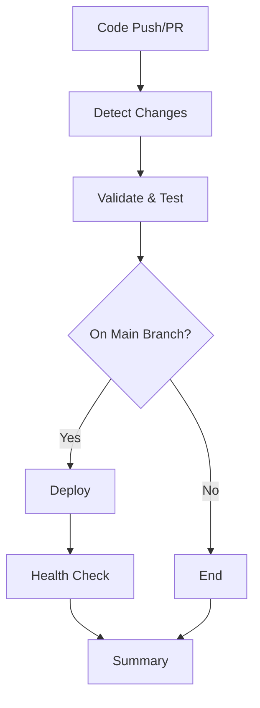

# CI/CD Pipeline Simplification

## 📊 Before vs After

### **Complexity Reduction**

- **Old Pipeline**: 658 lines
- **New Pipeline**: 213 lines
- **Reduction**: 67% fewer lines (445 lines removed)

### **Architecture Comparison**

#### ❌ **Old Pipeline Problems**

1. **Overly Complex**: 8+ jobs with complex dependency chains
2. **Redundant Matrices**: Running same checks across multiple environments
3. **Unnecessary Stages**: Separate jobs for similar validation tasks
4. **Complex Conditionals**: Multiple nested `if` statements
5. **Long Execution Time**: Sequential job dependencies causing delays
6. **Hard to Debug**: Complex logic spread across many jobs
7. **Resource Waste**: Running unnecessary checks on every change

#### ✅ **New Pipeline Benefits**

1. **Simple Structure**: 4 focused jobs (validate → deploy → health-check → summary)
2. **Smart Change Detection**: Only runs relevant checks based on changed files
3. **Parallel Execution**: TypeScript, linting, and tests run together
4. **Clear Flow**: Linear progression with obvious dependencies
5. **Faster Execution**: Optimized for speed and efficiency
6. **Easy to Understand**: Clear, readable structure
7. **Resource Efficient**: Skip unnecessary steps automatically

## 🔧 **What We Kept (Security & Validation)**

### **Security Measures** ✅

- **Azure OIDC Authentication**: Secure, keyless authentication
- **NPM Audit**: Dependency vulnerability scanning
- **Semgrep Security Scan**: Code security analysis
- **Environment Protection**: Production deployment requires approval
- **Secret Management**: All secrets properly managed through GitHub

### **Quality Validation** ✅

- **TypeScript Checking**: Full type validation
- **ESLint**: Code quality and style enforcement
- **Unit Tests**: Comprehensive test coverage
- **Infrastructure Validation**: Bicep template validation
- **Health Checks**: Post-deployment verification

### **Core CI/CD Features** ✅

- **Change Detection**: Smart path-based triggering
- **Build Optimization**: Efficient build process
- **Deployment Safety**: Only deploy on main branch
- **Rollback Capability**: Manual workflow dispatch
- **Status Reporting**: Clear pipeline summaries

## 🚀 **New Pipeline Flow**

### **Stage 1: Validate & Test** (Parallel execution)

- Change detection (backend/frontend/infra)
- TypeScript checking
- Code linting
- Security scanning
- Unit tests (if backend changed)
- Infrastructure validation (if infra changed)

### **Stage 2: Deploy** (Only on main branch)

- Azure authentication
- Backend deployment (if backend changed)
- Frontend deployment (if frontend changed)

### **Stage 3: Health Check**

- API health endpoint verification
- Quick 3-attempt validation

### **Stage 4: Summary**

- Results overview
- Change detection summary

## 📈 **Performance Improvements**

### **Execution Time**

- **Reduced Job Overhead**: 4 jobs instead of 8+
- **Parallel Validation**: TypeScript + Linting + Security run together
- **Smart Skipping**: Only run relevant checks
- **Faster Health Checks**: 3 attempts instead of 5

### **Resource Efficiency**

- **Conditional Deployments**: Only deploy what changed
- **Single Azure Login**: Reuse authentication across steps
- **Optimized Dependencies**: Minimal job dependencies

### **Developer Experience**

- **Faster Feedback**: Quicker validation results
- **Clear Status**: Easy-to-understand pipeline status
- **Less Noise**: Focused on what matters

## 🔒 **Security Maintained**

All critical security measures are preserved:

- ✅ Azure OIDC (keyless authentication)
- ✅ Dependency vulnerability scanning
- ✅ Code security analysis
- ✅ Environment protection
- ✅ Secret management
- ✅ Infrastructure validation

## 🎯 **What's Different**

### **Removed Complexity**

- ❌ Multiple environment matrices
- ❌ Redundant validation jobs
- ❌ Complex conditional logic
- ❌ Unnecessary job dependencies
- ❌ Over-engineered stage separation

### **Streamlined Features**

- ✅ Single validation job with multiple steps
- ✅ Simple conditional deployment
- ✅ Focused health checking
- ✅ Clear result summary

## 📝 **Migration Guide**

The new pipeline maintains all essential functionality while being much simpler:

1. **All security scanning**: Preserved
2. **Quality checks**: Preserved
3. **Deployment safety**: Preserved
4. **Health monitoring**: Preserved
5. **Change detection**: Improved
6. **Performance**: Significantly better

**No functionality lost, significant complexity removed.**
