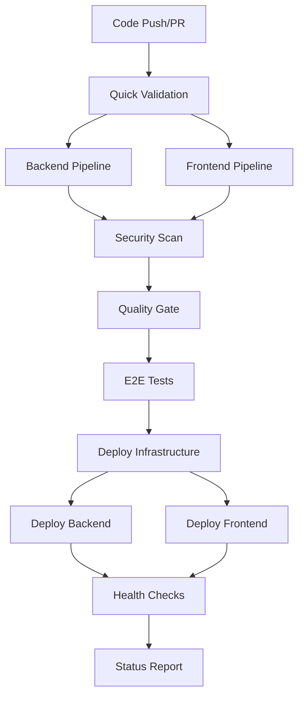

# VCarpool CI/CD Pipeline Guide

## 🎯 Overview

This document provides a comprehensive guide to the VCarpool application's robust CI/CD pipeline built with GitHub Actions. The pipeline is designed for cost optimization, reliability, security, and clear separation of concerns.

## 📋 Table of Contents

- [Pipeline Architecture](#pipeline-architecture)
- [Resource Groups & Infrastructure](#resource-groups--infrastructure)
- [GitHub Secrets Configuration](#github-secrets-configuration)
- [Pipeline Workflows](#pipeline-workflows)
- [Quality Gates](#quality-gates)
- [Deployment Strategy](#deployment-strategy)
- [Monitoring & Health Checks](#monitoring--health-checks)
- [Rollback Procedures](#rollback-procedures)
- [Troubleshooting](#troubleshooting)
- [Cost Optimization](#cost-optimization)

## 🏗 Pipeline Architecture

### Resource Group Organization

#### **vcarpool-db-rg** (Persistent Resources)

- **Cosmos DB Account**: `vcarpool-cosmos-prod`
- **Cosmos DB Database**: `vcarpool`
- **Storage Account**: `vcarpoolsaprod`
- **Key Vault**: `vcarpool-kv-prod`

#### **vcarpool-rg** (Compute Resources)

- **Azure Function App**: `vcarpool-api-prod`
- **Application Service Plan**: Consumption Y1
- **Application Insights**: `vcarpool-insights-prod`
- **Static Web App**: `vcarpool-web-prod`

### Pipeline Flow



## 🔐 GitHub Secrets Configuration

### Required Secrets

Configure these secrets in your GitHub repository settings:

#### Azure Authentication (OIDC)

```bash
AZURE_CLIENT_ID          # Azure App Registration Client ID
AZURE_TENANT_ID          # Azure Tenant ID
AZURE_SUBSCRIPTION_ID    # Azure Subscription ID
```

#### Static Web Apps

```bash
AZURE_STATIC_WEB_APPS_API_TOKEN  # From Azure Static Web Apps deployment token
```

### Azure OIDC Setup

1. **Create Azure App Registration**

```bash
az ad app create --display-name "vcarpool-github-actions"
```

2. **Create Service Principal**

```bash
az ad sp create --id <app-id>
```

3. **Assign Permissions**

```bash
# Contributor access to both resource groups
az role assignment create \
  --assignee <service-principal-id> \
  --role Contributor \
  --scope /subscriptions/<subscription-id>/resourceGroups/vcarpool-rg

az role assignment create \
  --assignee <service-principal-id> \
  --role Contributor \
  --scope /subscriptions/<subscription-id>/resourceGroups/vcarpool-db-rg
```

4. **Configure Federated Credentials**

```bash
# For main branch
az ad app federated-credential create \
  --id <app-id> \
  --parameters '{
    "name": "vcarpool-main",
    "issuer": "https://token.actions.githubusercontent.com",
    "subject": "repo:<username>/vcarpool:ref:refs/heads/main",
    "audiences": ["api://AzureADTokenExchange"]
  }'

# For pull requests
az ad app federated-credential create \
  --id <app-id> \
  --parameters '{
    "name": "vcarpool-pr",
    "issuer": "https://token.actions.githubusercontent.com",
    "subject": "repo:<username>/vcarpool:pull_request",
    "audiences": ["api://AzureADTokenExchange"]
  }'
```

## 🚀 Pipeline Workflows

### CI Pipeline (`.github/workflows/ci.yml`)

**Triggers:**

- Push to `main` branch
- Pull requests to `main`
- Manual dispatch with options

**Jobs:**

1. **Quick Validation** (5 min)

   - Change detection
   - Dependency validation
   - Fast failure for obvious issues

2. **Backend Pipeline** (15 min)

   - Lint and type checking
   - Unit tests with coverage (≥70%)
   - Integration tests
   - Build and artifact creation

3. **Frontend Pipeline** (12 min)

   - Lint and type checking
   - Unit tests with coverage
   - Build optimization
   - Artifact creation

4. **E2E Tests** (20 min, conditional)

   - Spin up backend and frontend
   - Playwright browser tests
   - Critical user flows validation

5. **Security Scan** (8 min, non-blocking)

   - Secret detection
   - NPM security audit
   - Circular dependency check

6. **Quality Gate** (5 min)
   - Enforce all critical checks
   - Generate comprehensive report

### Deploy Pipeline (`.github/workflows/deploy.yml`)

**Triggers:**

- Push to `main` (with path filters)
- Manual dispatch with force options

**Jobs:**

1. **Deployment Planning**

   - Change detection
   - Deployment scope determination
   - GitHub deployment creation

2. **Deploy Database RG** (20 min, conditional)

   - Persistent resources deployment
   - Resource validation

3. **Deploy Compute RG** (15 min, conditional)

   - Function App and Static Web App
   - Cross-resource group references

4. **Deploy Backend** (10 min, conditional)

   - Azure Functions deployment
   - Configuration from Key Vault

5. **Deploy Frontend** (8 min, conditional)

   - Static Web Apps deployment
   - CDN invalidation

6. **Health Checks** (10 min)
   - Comprehensive endpoint testing
   - Performance smoke tests
   - Rollback recommendations

## ✅ Quality Gates

### CI Quality Gates

- **Dependency Validation**: No invalid package versions
- **TypeScript Compilation**: Zero type errors
- **ESLint**: Code quality standards met
- **Test Coverage**: Minimum 70% line coverage
- **Build Success**: All packages compile without errors
- **E2E Tests**: Critical user flows pass (main branch)

### Deployment Quality Gates

- **Infrastructure First**: Database resources before compute
- **Change Detection**: Only deploy what changed
- **Health Validation**: Services respond correctly
- **Performance Check**: Response times acceptable

## 🚢 Deployment Strategy

### Single-Slot Deployment (Cost Optimized)

- **No Staging Slots**: Reduces costs by ~50%
- **Blue-Green at Infrastructure Level**: Two resource groups
- **Database Stability**: Persistent resources separate from compute
- **Rollback via Git**: Revert commit and redeploy

### Deployment Order

1. **Database RG**: Cosmos DB, Storage, Key Vault
2. **Compute RG**: Function App, Static Web App, Insights
3. **Backend Application**: Functions code deployment
4. **Frontend Application**: Static assets deployment
5. **Health Validation**: Comprehensive testing

### Environment Variables & Secrets

**From Key Vault (Backend):**

```
COSMOS_DB_CONNECTION_STRING
STORAGE_ACCOUNT_CONNECTION_STRING
JWT_SECRET
SENDGRID_API_KEY
```

**Build-time (Frontend):**

```
NEXT_PUBLIC_API_URL=https://vcarpool-api-prod.azurewebsites.net/api
NEXT_PUBLIC_ENVIRONMENT=production
```

## 🏥 Monitoring & Health Checks

### Backend Health Endpoints

- **Basic Health**: `/api/health` - Service status
- **Database Health**: `/api/health/db` - Database connectivity
- **Auth Health**: `/api/auth/health` - Authentication service

### Health Check Process

1. **10 Retry Attempts** with 30-second intervals
2. **Response Time Validation** (warn if >5s)
3. **Critical Endpoint Testing**
4. **Performance Smoke Tests**

### Application Insights Integration

- **Request Tracking**: API call monitoring
- **Exception Logging**: Error capture and analysis
- **Performance Metrics**: Response time tracking
- **Custom Events**: Business logic monitoring

## 🔄 Rollback Procedures

### Immediate Rollback (< 5 minutes)

#### Frontend Rollback

```bash
# 1. Revert the problematic commit
git revert <commit-hash>
git push origin main

# 2. Monitor deployment
# GitHub Actions will automatically deploy the reverted version
```

#### Backend Rollback

```bash
# Option 1: Via Azure CLI
az functionapp deployment source sync \
  --name vcarpool-api-prod \
  --resource-group vcarpool-rg

# Option 2: Via Functions Core Tools
func azure functionapp publish vcarpool-api-prod \
  --force \
  --typescript
```

### Infrastructure Rollback (15-30 minutes)

```bash
# Rollback to previous ARM template deployment
az deployment group create \
  --resource-group vcarpool-rg \
  --template-file infra/main-compute.bicep \
  --parameters @infra/main-compute.parameters.json \
  --mode Incremental
```

### Emergency Procedures

1. **Disable Traffic**: Scale Function App to 0 instances
2. **DNS Redirect**: Point subdomain to maintenance page
3. **Database Rollback**: Restore from automated backup
4. **Team Notification**: Slack/Teams alert with status

## 🛠 Troubleshooting

### Common Issues

#### CI Pipeline Failures

**Dependency Installation Fails**

```bash
# Clear package-lock and reinstall
rm package-lock.json
npm install
git add package-lock.json
git commit -m "fix: update package-lock.json"
```

**Test Coverage Below Threshold**

```bash
# Run coverage locally
npm run coverage:report
# Identify uncovered code in the HTML report
open backend/coverage/lcov-report/index.html
```

**E2E Tests Timeout**

```bash
# Check if services are starting correctly
cd backend && npm run func:start:ci
cd frontend && npm run build && npm run start
```

#### Deployment Failures

**Azure Authentication Failed**

- Verify OIDC configuration
- Check federated credentials
- Validate subscription access

**Resource Group Creation Failed**

- Check Azure subscription limits
- Verify location availability
- Ensure sufficient permissions

**Function App Deployment Failed**

```bash
# Check local build
cd backend
npm run build

# Test local deployment
func azure functionapp publish vcarpool-api-prod --typescript --dry-run
```

**Static Web App Deployment Failed**

- Verify deployment token
- Check build output directory
- Validate Next.js configuration

### Debug Commands

```bash
# Local development setup
npm run setup
npm run dev

# Test all components
npm run test:ci
npm run test:e2e

# Build verification
npm run build
npm run pre-commit

# Security scanning
npm run security:scan

# Performance testing
npm run perf:light
```

## 💰 Cost Optimization

### Current Monthly Estimates

- **Cosmos DB**: ~$25 (400 RU/s + free tier)
- **Storage Account**: ~$5 (Standard LRS)
- **Function App**: ~$10 (Consumption plan)
- **Static Web App**: ~$0 (Free tier)
- **Application Insights**: ~$5 (Basic monitoring)
- **Key Vault**: ~$3 (Standard tier)

**Total: ~$48/month**

### CI/CD Minutes Optimization

- **GitHub Actions**: 2,000 free minutes/month
- **Estimated Usage**: ~800 minutes/month
- **Optimization Strategies**:
  - Parallel job execution
  - Smart change detection
  - Conditional E2E tests
  - Artifact retention limits
  - Cache optimization

### Additional Cost Savings

- **Single-slot deployment**: 50% savings vs staging slots
- **Consumption-based Function App**: Pay per execution
- **Free tier Static Web Apps**: No hosting costs
- **Efficient caching**: Reduced build times

## 📊 Monitoring & Metrics

### Key Performance Indicators

- **Deployment Frequency**: Target: Daily
- **Lead Time**: Commit to production < 30 minutes
- **Mean Time to Recovery**: < 15 minutes
- **Change Failure Rate**: < 5%

### Dashboard URLs

- **Application Insights**: [Azure Portal Link]
- **Function App Logs**: [Azure Portal Link]
- **Static Web App Analytics**: [Azure Portal Link]
- **GitHub Actions**: [Repository Actions Tab]

### Alerts Configuration

- **Function App**: Response time > 30s
- **Cosmos DB**: RU/s consumption > 80%
- **Static Web App**: 4xx/5xx error rate > 1%
- **Pipeline**: Deployment failure notifications

## 📚 Additional Resources

- [Azure Functions Best Practices](https://docs.microsoft.com/en-us/azure/azure-functions/functions-best-practices)
- [Next.js Deployment Guide](https://nextjs.org/docs/deployment)
- [GitHub Actions Documentation](https://docs.github.com/en/actions)
- [Azure OIDC Configuration](https://docs.microsoft.com/en-us/azure/developer/github/connect-from-azure)

## 🔄 Maintenance Schedule

### Weekly Tasks

- Review pipeline metrics
- Update dependencies (Dependabot)
- Check security alerts
- Monitor costs

### Monthly Tasks

- Review and optimize build performance
- Update documentation
- Security audit
- Capacity planning review

### Quarterly Tasks

- Full disaster recovery test
- Review and update rollback procedures
- Pipeline optimization review
- Team training on new features

---

**Last Updated**: December 2024  
**Maintained by**: DevOps Team  
**Version**: 2.0
