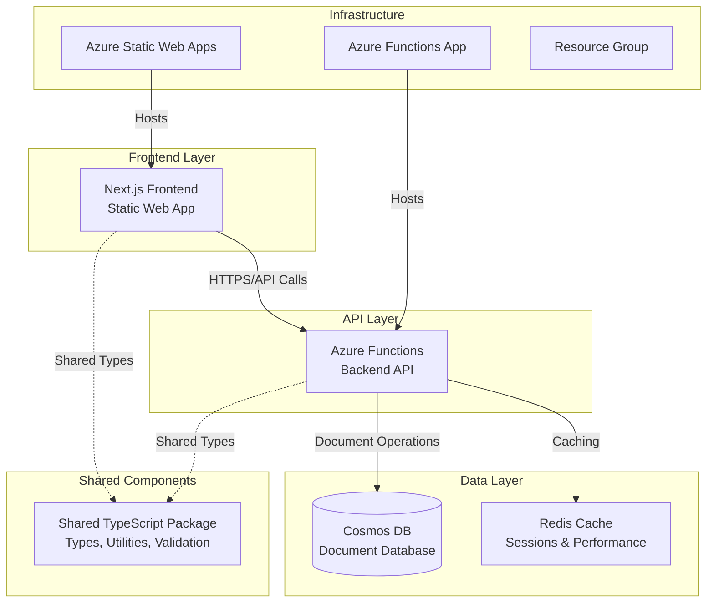
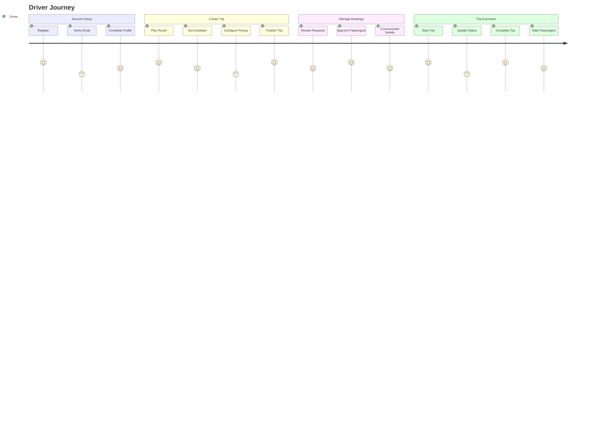
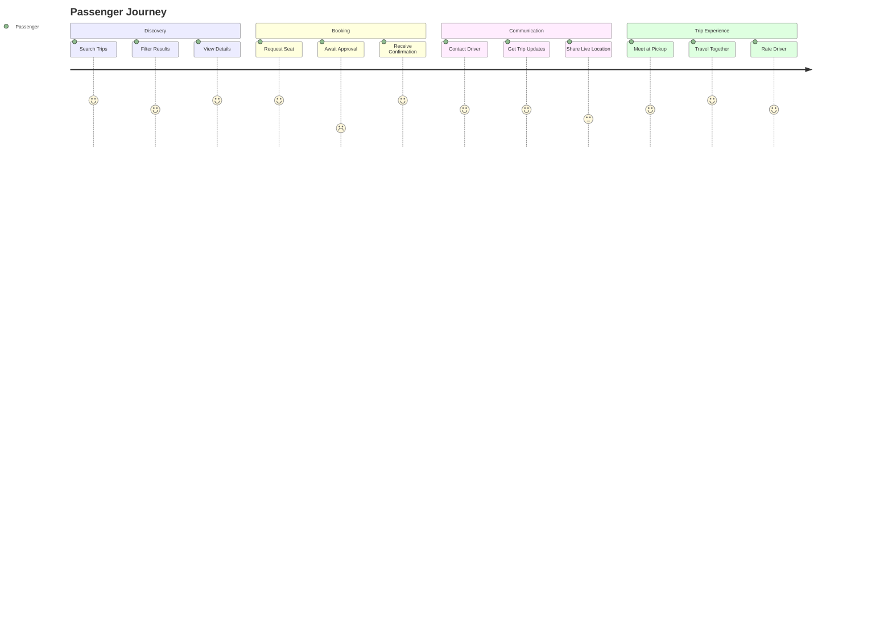

# PROJECT_METADATA.md

## 1. Project Overview

### 1.1 Purpose

VCarpool is a modern carpooling application designed to connect drivers and passengers for shared transportation. The platform facilitates eco-friendly commuting by enabling users to share rides, split costs, and reduce environmental impact through collaborative transportation.

### 1.2 Stakeholders

- **End Users**: Drivers and passengers seeking shared transportation
- **Development Team**: Full-stack developers, DevOps engineers
- **Platform Owner**: Service administrators and moderators

### 1.3 High-Level Goals

- **Primary**: Enable efficient ride-sharing through a user-friendly platform
- **Secondary**: Reduce transportation costs and environmental impact
- **Technical**: Deliver a scalable, secure, and maintainable cloud-native application

## 2. System Architecture

### 2.1 Overview & Diagram



### 2.2 Technology Stack

**Frontend:**

- **Framework**: Next.js 14+ with TypeScript
- **Styling**: Tailwind CSS
- **State Management**: React hooks, context
- **Authentication**: Azure Static Web Apps authentication
- **Deployment**: Azure Static Web Apps
- **Build**: Static export for optimal performance

**Backend:**

- **Runtime**: Node.js 22+, Azure Functions v4
- **Language**: TypeScript
- **Authentication**: JWT tokens, bcrypt for passwords
- **Deployment**: Azure Functions (Consumption plan)
- **Programming Model**: Azure Functions v4 (app.http)

**Database & Storage:**

- **Primary Database**: Azure Cosmos DB (NoSQL, serverless)
- **Caching**: Redis (ioredis client)
- **File Storage**: Azure Blob Storage (planned)

**Shared Infrastructure:**

- **Monorepo**: npm workspaces
- **Package Management**: npm
- **Testing**: Jest, Playwright (E2E)
- **CI/CD**: GitHub Actions
- **Infrastructure**: Azure Resource Manager

### 2.3 Core Components & Interactions

1. **Frontend (Next.js)**

   - Serves user interface
   - Handles client-side routing and state
   - Communicates with backend via REST APIs
   - Manages user authentication flows

2. **Backend (Azure Functions)**

   - Provides REST API endpoints
   - Handles business logic and data validation
   - Manages user authentication and authorization
   - Integrates with external services

3. **Shared Package**

   - Common TypeScript types and interfaces
   - Validation schemas (Zod)
   - Utility functions
   - API contracts

4. **Database Layer**
   - Cosmos DB for persistent data storage
   - Redis for session management and caching
   - Optimized for global distribution

### 2.4 Data Model Overview

**Core Entities:**

- **Users**: Authentication, profile, preferences
- **Trips**: Origin, destination, schedule, capacity
- **Bookings**: User-trip relationships, status tracking
- **Messages**: Trip-based communication system
- **Chats**: Real-time messaging channels

## 3. Key Features and Functionality

### 3.1 Authentication & User Management

- User registration and login
- Password reset functionality
- Profile management
- JWT-based session management

### 3.2 Trip Management

- Create, update, delete trips
- Search and filter available trips
- Trip details and route information
- Capacity and pricing management

### 3.3 Booking System

- Join/leave trips
- Booking status tracking
- Payment integration (planned)
- Trip history

### 3.4 Communication

- In-trip messaging
- Real-time chat functionality
- Notification system
- Trip-related announcements

### 3.5 Security & Monitoring

- Health check endpoints
- Request rate limiting
- Input validation and sanitization
- Application monitoring and logging

## 4. User Experience & Journey Mapping

### 4.1 Primary User Journeys

**Driver Journey**:



**Passenger Journey**:



### 4.2 Critical User Experience Requirements

- **Mobile-First Design**: 80% of users access via mobile devices
- **Offline Capability**: Basic trip details available without connection
- **Real-Time Updates**: Trip status and communication updates
- **Accessibility**: WCAG 2.1 AA compliance for inclusive design

### 4.3 Common Pain Points & Solutions

- **Trip Discovery**: Complex search → Smart filtering and recommendations
- **Trust & Safety**: Unknown users → Profile verification and rating system
- **Communication**: Coordination challenges → In-app messaging and notifications
- **Payment**: Split cost complexity → Integrated payment and automatic splitting

## 5. Performance Requirements & Constraints

### 5.1 Performance Targets

**Response Time SLAs**:

- **Authentication**: < 500ms for login/register
- **Trip Search**: < 1000ms for filtered results
- **Trip Creation**: < 800ms for form submission
- **Chat Messages**: < 300ms for send/receive
- **Page Navigation**: < 200ms for cached routes

**Concurrency Limits**:

- **Peak Users**: 1,000 simultaneous active users
- **Trip Search**: 100 concurrent search operations
- **Database**: 1,000 RU/s baseline, 10,000 RU/s burst

**Availability Targets**:

- **Uptime**: 99.5% (excluding planned maintenance)
- **API Availability**: 99.9% for critical endpoints
- **Cold Start**: < 2 seconds for Azure Functions

### 5.2 Scalability Constraints

- **Budget**: $200/month operational cost limit
- **Azure Tier**: Free/consumption tiers where possible
- **Data Storage**: < 10GB initial, < 100GB projected growth
- **Geographic**: Single region (East US 2) initially

### 5.3 Performance Monitoring Strategy

- **Health Checks**: Automated monitoring every 5 minutes
- **Response Time Tracking**: 95th percentile monitoring
- **Error Rate Alerts**: > 5% error rate triggers alerts
- **Resource Usage**: Track function execution time and memory

## 6. Security & Compliance Framework

### 6.1 Data Classification

**Highly Sensitive**:

- User passwords (bcrypt hashed)
- JWT tokens and refresh tokens
- Payment information (when implemented)

**Moderately Sensitive**:

- Personal profiles (name, phone, email)
- Trip location data
- Private messages

**Public Data**:

- Trip listings (without personal details)
- General location areas
- Public ratings and reviews

### 6.2 Security Controls

**Authentication & Authorization**:

- JWT tokens with 24-hour expiration
- Refresh token rotation every 7 days
- Role-based access control (driver, passenger, admin)
- Multi-factor authentication (planned)

**Data Protection**:

- HTTPS/TLS 1.3 for all communications
- Input validation using Zod schemas
- SQL injection prevention (NoSQL with parameterized queries)
- XSS protection via Content Security Policy

**Privacy Controls**:

- GDPR compliance for EU users
- Data retention policies (2 years for inactive accounts)
- User data export/deletion capabilities
- Location data anonymization for analytics

### 6.3 Threat Model & Mitigations

**High Priority Threats**:

- **Account Takeover**: MFA, rate limiting, anomaly detection
- **Data Breach**: Encryption at rest, access logging, least privilege
- **Fraud/Fake Profiles**: Identity verification, behavioral analysis
- **Location Privacy**: Approximate locations, data minimization

## 7. Error Scenarios & Recovery Procedures

### 7.1 Common Failure Modes

**Azure Functions Cold Start**:

- **Scenario**: Function takes > 10 seconds to respond
- **Recovery**: Client-side retry with exponential backoff
- **Prevention**: Health check warming, optimized deployment size

**Cosmos DB Throttling**:

- **Scenario**: 429 Too Many Requests during peak usage
- **Recovery**: Client-side retry with jitter, request queuing
- **Prevention**: Request unit monitoring, auto-scaling alerts

**Authentication Token Expiry**:

- **Scenario**: User session expires during active use
- **Recovery**: Automatic refresh token exchange, seamless re-auth
- **Prevention**: Proactive token refresh before expiry

**Network Connectivity Issues**:

- **Scenario**: User loses internet during trip
- **Recovery**: Offline mode with local storage, sync when reconnected
- **Prevention**: Progressive web app capabilities, data caching

### 7.2 Error Response Standards

**API Error Format**:

```typescript
interface ErrorResponse {
  success: false;
  error: {
    code: string; // Stable error identifier
    message: string; // User-friendly message
    details?: any; // Technical details for debugging
    retryAfter?: number; // Seconds to wait before retry
  };
  requestId: string; // For support tracking
}
```

**Error Categories**:

- **4xx Client Errors**: Validation, authentication, authorization
- **5xx Server Errors**: Database, external service, system failures
- **Custom Codes**: Business logic violations, resource conflicts

### 7.3 Incident Response Procedures

**Severity Levels**:

- **Critical**: System down, data loss, security breach
- **High**: Major feature broken, performance severely degraded
- **Medium**: Minor feature issues, isolated user impact
- **Low**: Cosmetic issues, enhancement requests

**Response Timeline**:

- **Critical**: 15 minutes detection, 1 hour mitigation
- **High**: 1 hour detection, 4 hours resolution
- **Medium**: 24 hours acknowledgment, 1 week resolution

## 8. External Dependencies & Integration Points

### 8.1 Current External Services

**Azure Services**:

- **Azure Static Web Apps**: Frontend hosting and authentication
- **Azure Functions**: Backend API hosting
- **Azure Cosmos DB**: Primary data storage
- **Azure Application Insights**: Monitoring and analytics

**Third-Party Services (Planned)**:

- **Mapping Service**: Google Maps API or Azure Maps
- **Payment Processing**: Stripe or PayPal integration
- **SMS/Email**: Twilio for notifications
- **Push Notifications**: Azure Notification Hubs

### 8.2 Integration Patterns

**Service-to-Service Communication**:

- REST APIs with JSON payloads
- Authentication via API keys or OAuth
- Circuit breaker pattern for fault tolerance
- Async processing for non-critical operations

**Rate Limiting & Quotas**:

- Azure Functions: 200 executions/second
- Cosmos DB: 1,000-10,000 RU/s based on usage
- External APIs: Service-specific limits (to be documented)

### 8.3 Fallback Strategies

**Mapping Service Failure**:

- **Primary**: Google Maps API
- **Fallback**: Cached location data, manual address entry
- **Degraded**: Basic text-based location matching

**Payment Service Failure**:

- **Primary**: Stripe payment processing
- **Fallback**: Manual payment coordination via messaging
- **Degraded**: Cash-based transactions with trust system

## 9. Testing Strategy & Quality Assurance

### 9.1 Testing Pyramid

**Unit Tests (Jest)**:

- **Coverage Target**: 80% line coverage minimum
- **Focus Areas**: Business logic, validation functions, utilities
- **Run Frequency**: Every commit, < 30 seconds execution

**Integration Tests**:

- **API Endpoints**: All CRUD operations with database
- **Authentication Flows**: Login, register, token refresh
- **Critical Paths**: Trip creation → booking → completion

**End-to-End Tests (Playwright)**:

- **User Journeys**: Complete driver and passenger workflows
- **Cross-Browser**: Chrome, Firefox, Safari, Mobile browsers
- **Run Frequency**: Before production deployment

### 9.2 Quality Gates

**Pre-Commit Checks**:

- TypeScript compilation without errors
- ESLint rules pass (no warnings in production code)
- Unit tests pass with coverage threshold
- Zod schema validation tests

**Pre-Deployment Checks**:

- All tests pass in CI/CD pipeline
- Health checks succeed in staging environment
- Performance benchmarks within acceptable range
- Security scan passes (planned)

### 9.3 Performance Testing

**Load Testing Scenarios**:

- **Normal Load**: 100 concurrent users
- **Peak Load**: 500 concurrent users
- **Stress Test**: 1,000+ users to find breaking point
- **Spike Test**: Sudden traffic bursts

**Key Metrics to Monitor**:

- Response time distribution (p50, p95, p99)
- Error rate under load
- Resource utilization (CPU, memory, RU consumption)
- User experience metrics (time to interactive)

## 10. Operational Procedures & Monitoring

### 10.1 Deployment Strategy

**Environment Pipeline**:

- **Local Development**: Individual developer machines
- **Staging**: Pre-production testing environment
- **Production**: Live user-facing environment

**Deployment Process**:

- **Automated CI/CD**: GitHub Actions triggers on main branch
- **Blue-Green Deployment**: Zero-downtime deployments (planned)
- **Rollback Capability**: 5-minute rollback to previous version
- **Feature Flags**: Gradual feature rollout (planned)

### 10.2 Monitoring & Alerting

**Health Monitoring**:

- **Application Health**: `/api/health` endpoint every 5 minutes
- **Database Health**: Connection and response time monitoring
- **External Dependencies**: Third-party service availability

**Alert Thresholds**:

- **Response Time**: > 2 seconds for critical endpoints
- **Error Rate**: > 5% for any 5-minute period
- **Availability**: < 99% uptime for any 1-hour period
- **Resource Usage**: > 80% CPU/memory for 10+ minutes

**Alert Channels**:

- **Critical**: SMS + Email + Slack
- **High**: Email + Slack
- **Medium**: Slack notification
- **Low**: Dashboard notification only

### 10.3 Debugging & Troubleshooting

**Logging Strategy**:

- **Structured Logging**: JSON format with correlation IDs
- **Log Levels**: ERROR, WARN, INFO, DEBUG
- **Retention**: 30 days for application logs, 90 days for audit logs
- **PII Handling**: No sensitive data in logs

**Common Debugging Procedures**:

- **User Issues**: Trace request flow via correlation ID
- **Performance Issues**: Analyze Application Insights metrics
- **Database Issues**: Check Cosmos DB metrics and query performance
- **Authentication Issues**: Review JWT validation and refresh flows

**Support Tools**:

- **Azure Application Insights**: Performance and error tracking
- **Azure Monitor**: Infrastructure and resource monitoring
- **Log Analytics**: Advanced log querying and analysis

## 11. Current Risks and Technical Debt

### 11.1 Technical Debt

- **Mixed Function Models**: Legacy traditional Azure Functions alongside v4 model
- **Limited Error Handling**: Basic error responses, needs comprehensive error taxonomy
- **Testing Coverage**: Integration tests needed for complex workflows
- **Performance Monitoring**: Basic health checks, needs APM integration
- **API Documentation**: Missing OpenAPI specifications for all endpoints
- **Security Audit**: No formal security assessment completed

### 11.2 Risks

- **Cold Start Latency**: Azure Functions cold starts affecting user experience
- **Authentication Complexity**: JWT management and refresh token security
- **Data Consistency**: Eventual consistency challenges with Cosmos DB
- **Deployment Dependencies**: Monorepo coupling between frontend and backend deployments
- **Vendor Lock-in**: Heavy dependency on Azure ecosystem
- **Scale Limitations**: Current architecture may not handle 10x growth efficiently

### 11.3 Mitigation Strategies

- Improved health checks and monitoring (recently implemented)
- Staged deployments with better error handling
- Comprehensive testing strategy implementation
- Performance optimization and caching strategies
- Regular security audits and dependency updates
- Multi-cloud strategy evaluation for critical components

## 12. Team Dynamics & Development Workflow

### 12.1 Development Standards

**Code Review Requirements**:

- All changes require at least one approval
- Focus on security, performance, and maintainability
- Automated checks must pass before merge
- Documentation updates for API changes

**Git Workflow**:

- **Main Branch**: Always deployable, protected
- **Feature Branches**: Short-lived, focused changes
- **Commit Messages**: Conventional commits format
- **Merge Strategy**: Squash and merge for clean history

### 12.2 Knowledge Management

**Documentation Standards**:

- **API Changes**: Update OpenAPI specs and examples
- **Architecture Changes**: Update PROJECT_METADATA.md
- **Deployment Changes**: Update runbooks and procedures
- **Security Changes**: Update threat model and controls

**Team Communication**:

- **Daily Standups**: Progress, blockers, coordination
- **Weekly Reviews**: Architecture decisions, technical debt
- **Monthly Retrospectives**: Process improvements

## 13. Metadata Evolution Log

### Recent Updates (June 2025)

- **CI/CD Pipeline Issues Resolved**: Fixed health endpoint conflicts and frontend verification
- **Health Check Improvements**: Enhanced resilience for Azure Functions cold starts
- **Documentation**: Added comprehensive backend README and deployment guides
- **Code Cleanup**: Removed duplicate health endpoint implementations
- **Comprehensive Metadata**: Added user journeys, performance requirements, and operational procedures

### Pending Clarifications

- [ ] Payment integration timeline and provider selection
- [ ] Real-time messaging implementation approach (WebSocket vs polling)
- [ ] File upload requirements for user profiles and trip images
- [ ] Internationalization (i18n) priority and supported languages
- [ ] Advanced search features (geolocation, preferences)
- [ ] Specific performance SLA agreements with stakeholders
- [ ] Security audit schedule and requirements
- [ ] Mobile app development strategy and timeline

### Outdated Areas to Update

- [ ] API documentation needs OpenAPI/Swagger generation
- [ ] Performance benchmarks and optimization targets
- [ ] Security audit findings and remediation plan
- [ ] Mobile app strategy (PWA vs native)
- [ ] Load testing results and capacity planning
- [ ] Incident response procedures testing

---

## Suggested Change Proposal Template

When proposing significant changes, use the following template to ensure clarity and alignment:

### Proposed Change:

[Detailed description of the proposed change]

### Rationale:

[Why this change is necessary, what problem it solves]

### Affected Modules/Sections:

[List of components, APIs, or features that will be impacted]

### Impact on Metadata:

- [ ] Update Required
- [ ] No Change Needed

### Suggested Metadata Updates:

[Specific sections of this document that need updates]

---

_This metadata document is a living document and should be updated with any architectural changes, new features, or design decisions. Last updated: June 2025_
