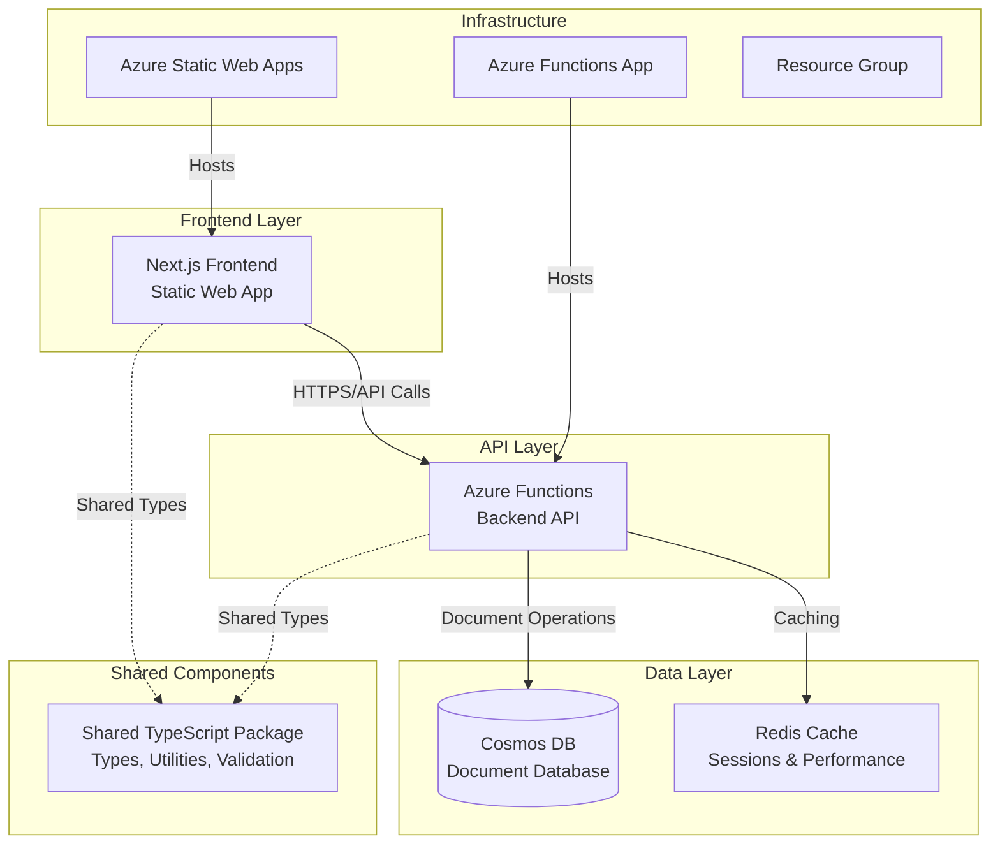

# PROJECT_METADATA.md

## 1. Project Overview

### 1.1 Purpose

VCarpool is a modern carpooling application designed to connect drivers and passengers for shared transportation. The platform facilitates eco-friendly commuting by enabling users to share rides, split costs, and reduce environmental impact through collaborative transportation.

### 1.2 Stakeholders

- **End Users**: Drivers and passengers seeking shared transportation
- **Development Team**: Full-stack developers, DevOps engineers
- **Platform Owner**: Service administrators and moderators

### 1.3 High-Level Goals

- **Primary**: Enable efficient ride-sharing through a user-friendly platform
- **Secondary**: Reduce transportation costs and environmental impact
- **Technical**: Deliver a scalable, secure, and maintainable cloud-native application

## 2. System Architecture

### 2.1 Overview & Diagram



### 2.2 Technology Stack

**Frontend:**

- **Framework**: Next.js 14+ with TypeScript
- **Styling**: Tailwind CSS
- **State Management**: React hooks, context
- **Authentication**: Azure Static Web Apps authentication
- **Deployment**: Azure Static Web Apps
- **Build**: Static export for optimal performance

**Backend:**

- **Runtime**: Node.js 22+, Azure Functions v4
- **Language**: TypeScript
- **Authentication**: JWT tokens, bcrypt for passwords
- **Deployment**: Azure Functions (Consumption plan)
- **Programming Model**: Azure Functions v4 (app.http)

**Database & Storage:**

- **Primary Database**: Azure Cosmos DB (NoSQL, serverless)
- **Caching**: Redis (ioredis client)
- **File Storage**: Azure Blob Storage (planned)

**Shared Infrastructure:**

- **Monorepo**: npm workspaces
- **Package Management**: npm
- **Testing**: Jest, Playwright (E2E)
- **CI/CD**: GitHub Actions
- **Infrastructure**: Azure Resource Manager

### 2.3 Core Components & Interactions

1. **Frontend (Next.js)**

   - Serves user interface
   - Handles client-side routing and state
   - Communicates with backend via REST APIs
   - Manages user authentication flows

2. **Backend (Azure Functions)**

   - Provides REST API endpoints
   - Handles business logic and data validation
   - Manages user authentication and authorization
   - Integrates with external services

3. **Shared Package**

   - Common TypeScript types and interfaces
   - Validation schemas (Zod)
   - Utility functions
   - API contracts

4. **Database Layer**
   - Cosmos DB for persistent data storage
   - Redis for session management and caching
   - Optimized for global distribution

### 2.4 Data Model Overview

**Core Entities:**

- **Users**: Authentication, profile, preferences
- **Trips**: Origin, destination, schedule, capacity
- **Bookings**: User-trip relationships, status tracking
- **Messages**: Trip-based communication system
- **Chats**: Real-time messaging channels

## 3. Key Features and Functionality

### 3.1 Authentication & User Management

- User registration and login
- Password reset functionality
- Profile management
- JWT-based session management

### 3.2 Trip Management

- Create, update, delete trips
- Search and filter available trips
- Trip details and route information
- Capacity and pricing management

### 3.3 Booking System

- Join/leave trips
- Booking status tracking
- Payment integration (planned)
- Trip history

### 3.4 Communication

- In-trip messaging
- Real-time chat functionality
- Notification system
- Trip-related announcements

### 3.5 Security & Monitoring

- Health check endpoints
- Request rate limiting
- Input validation and sanitization
- Application monitoring and logging

## 4. Design Principles

### 4.1 Core Principles

- **Security-First**: All inputs validated, authentication required, secure defaults
- **Performance**: Optimized builds, caching strategies, serverless architecture
- **Maintainability**: TypeScript everywhere, shared types, comprehensive testing
- **Scalability**: Serverless functions, NoSQL database, stateless design
- **User Experience**: Responsive design, fast loading, intuitive navigation

### 4.2 Code Standards

- **TypeScript**: Strict mode enabled, comprehensive typing
- **Validation**: Zod schemas for runtime validation
- **Error Handling**: Consistent error responses, proper logging
- **Testing**: Unit tests, integration tests, E2E testing
- **Documentation**: Inline comments, API documentation

## 5. Known Constraints, Assumptions, and Design Decisions

### 5.1 Constraints

- **Budget**: Free/low-cost Azure tiers (Consumption plans, serverless)
- **Geographic**: Initial focus on single region deployment
- **Scale**: Designed for moderate traffic (< 10k users initially)
- **Compliance**: Basic data protection, GDPR considerations

### 5.2 Assumptions

- Users have modern browsers with JavaScript enabled
- Primary access via mobile devices
- English as primary language (i18n planned)
- Payment integration will be added in future iterations

### 5.3 Design Decisions & Rationale

**Azure Functions v4 Model**:

- _Decision_: Use new programming model (app.http) for new functions
- _Rationale_: Better TypeScript integration, improved developer experience
- _Trade-off_: Cannot mix with traditional model in same deployment

**Static Export for Frontend**:

- _Decision_: Next.js static export to Azure Static Web Apps
- _Rationale_: Cost optimization, global CDN, simplified deployment
- _Trade-off_: No server-side rendering, limited dynamic capabilities

**Cosmos DB NoSQL**:

- _Decision_: Document database over relational
- _Rationale_: Serverless pricing, global distribution, JSON-native
- _Trade-off_: Less mature querying, eventual consistency

**Monorepo Structure**:

- _Decision_: Single repository with multiple packages
- _Rationale_: Shared types, coordinated deployments, simplified development
- _Trade-off_: Larger repository, potential deployment coupling

## 6. Core Modules/Services and Responsibilities

### 6.1 Backend Functions (Azure Functions)

**Authentication Services**:

- `auth-login`: User authentication and JWT generation
- `auth-register`: New user registration
- `auth-refresh-token`: Token renewal
- `auth-forgot-password`: Password reset initiation
- `auth-reset-password`: Password reset completion

**User Management**:

- `users-me`: Get current user profile
- `users-update`: Update user information
- `users-change-password`: Password change functionality

**Trip Management**:

- `trips-create`: Create new trips
- `trips-list`: Search and list available trips
- `trips-get`: Get trip details
- `trips-update`: Modify trip information
- `trips-delete`: Remove trips
- `trips-stats`: Trip analytics and statistics
- `trips-join`: Join a trip
- `trips-leave`: Leave a trip

**Communication**:

- `chats-create`: Create chat channels
- `chats-get`: Retrieve chat messages
- `messages-send`: Send messages
- `messages-get`: Retrieve message history

**System**:

- `health`: Health check endpoint for monitoring

### 6.2 Frontend Pages and Components

**Authentication Pages**:

- Login, Registration, Password Reset
- Protected route middleware

**Main Application**:

- Dashboard, Trip Search, Trip Creation
- User Profile, Trip Management
- Chat and Messaging Interface

**Shared Components**:

- Navigation, Forms, Modals
- Trip Cards, User Components
- Loading States, Error Handling

## 7. Key APIs and Data Contracts

### 7.1 Authentication APIs

```typescript
// Login
POST /api/auth/login
Body: { email: string, password: string }
Response: { success: boolean, token: string, user: User }

// Register
POST /api/auth/register
Body: { email: string, password: string, name: string }
Response: { success: boolean, user: User }
```

### 7.2 Trip Management APIs

```typescript
// Create Trip
POST /api/trips/create
Body: { origin: string, destination: string, datetime: string, capacity: number, price?: number }
Response: { success: boolean, trip: Trip }

// List Trips
GET /api/trips/list?origin=&destination=&date=
Response: { success: boolean, trips: Trip[], pagination: Pagination }
```

### 7.3 Data Contracts

**User Entity**:

```typescript
interface User {
  id: string;
  email: string;
  name: string;
  phone?: string;
  verified: boolean;
  createdAt: string;
  updatedAt: string;
}
```

**Trip Entity**:

```typescript
interface Trip {
  id: string;
  driverId: string;
  origin: string;
  destination: string;
  datetime: string;
  capacity: number;
  availableSeats: number;
  price?: number;
  status: "active" | "completed" | "cancelled";
  passengers: string[];
  createdAt: string;
  updatedAt: string;
}
```

## 8. Critical Business Logic Summary

### 8.1 Trip Booking Logic

- Users can only join trips with available seats
- Drivers cannot join their own trips
- Booking status transitions: pending → confirmed → completed
- Automatic seat count management

### 8.2 Authentication & Authorization

- JWT tokens with 24-hour expiration
- Refresh token mechanism for seamless UX
- Role-based access (driver, passenger)
- Protected routes require valid authentication

### 8.3 Search and Matching

- Location-based trip search
- Date/time filtering for relevance
- Distance calculations for proximity matching
- Real-time availability updates

### 8.4 Communication Rules

- Chat access limited to trip participants
- Message history preserved for trip duration
- Real-time delivery via WebSocket (planned)
- Moderation capabilities for safety

## 9. Glossary of Terms / Domain Concepts

- **Driver**: User who creates and owns a trip
- **Passenger**: User who joins someone else's trip
- **Trip**: A scheduled journey from origin to destination
- **Booking**: A passenger's reservation for a specific trip
- **Seat**: Available capacity unit in a trip
- **Route**: The path from origin to destination
- **Chat**: Communication channel for trip participants

## 10. Current Risks and Technical Debt

### 10.1 Technical Debt

- **Mixed Function Models**: Legacy traditional Azure Functions alongside v4 model
- **Limited Error Handling**: Basic error responses, needs comprehensive error taxonomy
- **Testing Coverage**: Integration tests needed for complex workflows
- **Performance Monitoring**: Basic health checks, needs APM integration

### 10.2 Risks

- **Cold Start Latency**: Azure Functions cold starts affecting user experience
- **Authentication Complexity**: JWT management and refresh token security
- **Data Consistency**: Eventual consistency challenges with Cosmos DB
- **Deployment Dependencies**: Monorepo coupling between frontend and backend deployments

### 10.3 Mitigation Strategies

- Improved health checks and monitoring (recently implemented)
- Staged deployments with better error handling
- Comprehensive testing strategy implementation
- Performance optimization and caching strategies

## 11. Metadata Evolution Log

### Recent Updates (June 2025)

- **CI/CD Pipeline Issues Resolved**: Fixed health endpoint conflicts and frontend verification
- **Health Check Improvements**: Enhanced resilience for Azure Functions cold starts
- **Documentation**: Added comprehensive backend README and deployment guides
- **Code Cleanup**: Removed duplicate health endpoint implementations

### Pending Clarifications

- [ ] Payment integration timeline and provider selection
- [ ] Real-time messaging implementation approach (WebSocket vs polling)
- [ ] File upload requirements for user profiles and trip images
- [ ] Internationalization (i18n) priority and supported languages
- [ ] Advanced search features (geolocation, preferences)

### Outdated Areas to Update

- [ ] API documentation needs OpenAPI/Swagger generation
- [ ] Performance benchmarks and optimization targets
- [ ] Security audit findings and remediation plan
- [ ] Mobile app strategy (PWA vs native)

---

## Suggested Change Proposal Template

When proposing significant changes, use the following template to ensure clarity and alignment:

### Proposed Change:

[Detailed description of the proposed change]

### Rationale:

[Why this change is necessary, what problem it solves]

### Affected Modules/Sections:

[List of components, APIs, or features that will be impacted]

### Impact on Metadata:

- [ ] Update Required
- [ ] No Change Needed

### Suggested Metadata Updates:

[Specific sections of this document that need updates]

---

_This metadata document is a living document and should be updated with any architectural changes, new features, or design decisions. Last updated: June 2025_
